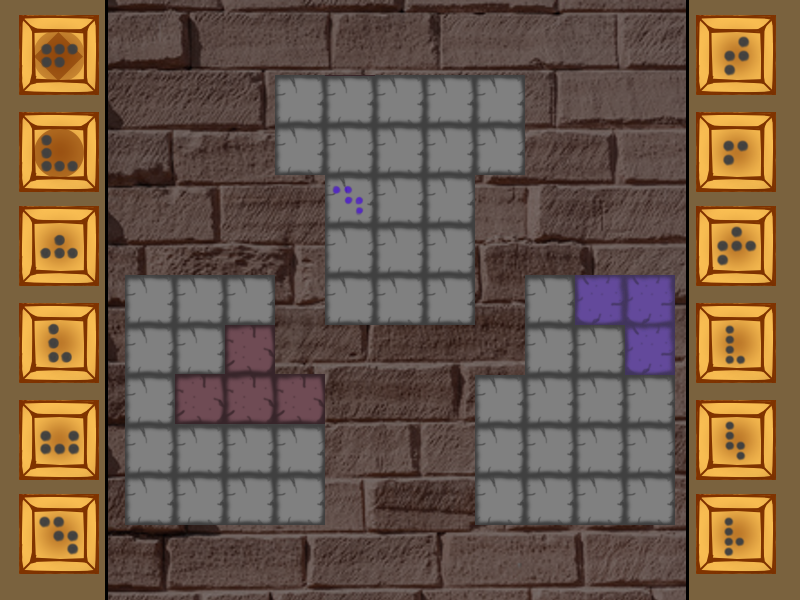
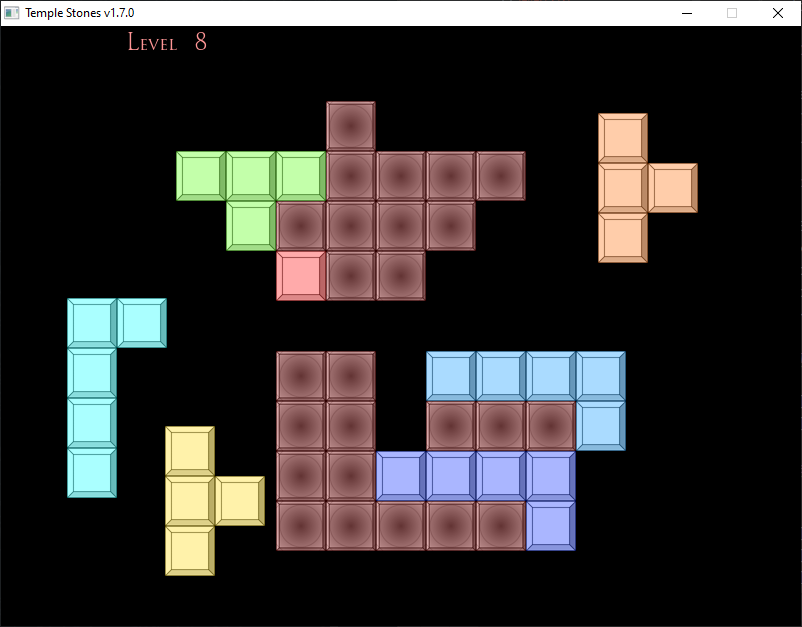

# Temple Stones v1.9.0

- A game where you place pieces on a board in order to fulfill certain winning conditions (such as filling up the board completely, all but one tile etc.).

- A very rough mock-up of what the final game will look like (none of the assets are final):

- Right now, the game looks like this:

## How to play

- Place pieces on the board with your mouse.
- Left Click: Picks up a piece. Click again to release it. If the piece has space to fit on the board, it will be placed on it.
- Right Click: Rotates the held piece clockwise.
- Middle Click: Flips the piece.
- There's no level select screen, so if you want to go to a certain level, close the game, and write the level number in resources/latestlevel.txt.

### Current state of the game

- Basic piece placement logic has been implemented, as well as a super-basic level file parser and level advancement system.
- Currently there are 12 levels, most of them unpolished, plus some testing levels (level 13).
- Different board types have been implemented.

## To be implemented/done

- Add restriction mechanic (in the mockup, the symbol on the board indicates that piece must be placed on that tile)
- A Button class (UI, not only for the menu, but also in-game, as the pieces will be accesed by the buttons on the side, as seen in the mock-up)
- Texture Loader for the pieces (a good one, right now it's just a class with a static map, will probably template)
- (scrapped for now) A level select screen (Menu class, and so much more)
- Polish the levels, and finalize the level order

### Tema 0

- [x] Nume proiect (poate fi schimbat ulterior)
- [x] Scurtă descriere a temei alese, ce v-ați propus să implementați

## Tema 1

#### Cerințe
- [x] definirea a minim 3-4 clase folosind compunere
- [x] constructori de inițializare
- [x] pentru o clasă: constructor de copiere, `operator=` de copiere, destructor
<!-- - [ ] pentru o altă clasă: constructor de mutare, `operator=` de mutare, destructor -->
<!-- - [ ] pentru o altă clasă: toate cele 5 funcții membru speciale -->
- [x] `operator<<` pentru toate clasele pentru afișare (std::ostream)
- [x] cât mai multe `const` (unde este cazul)
- [x] implementarea a minim 3 funcții membru publice pentru funcționalități specifice temei alese
- [x] scenariu de utilizare a claselor definite:
  - crearea de obiecte și apelarea funcțiilor membru publice în main
  - vor fi adăugate în fișierul `tastatura.txt` exemple de date de intrare de la tastatură (dacă există)
- [x] tag de `git`: de exemplu `v0.1`
- [] serviciu de integrare continuă (CI); exemplu: GitHub Actions

## Tema 2

#### Cerințe
- [x] separarea codului din clase în `.h` (sau `.hpp`) și `.cpp`
- [x] moșteniri
  - [x] clasă cu atribut de tip pointer la o clasă de bază cu derivate
  - [x] funcții virtuale (pure) apelate prin pointeri de bază din clasa de mai sus, constructori virtuali (clone)
    - minim o funcție virtuală va fi **specifică temei** (e.g. nu simple citiri/afișări)
  - [x] apelarea constructorului din clasa de bază din constructori din derivate
  - [x] smart pointers
  - [x] `dynamic_cast`
- [x] suprascris cc/op= pentru copieri/atribuiri corecte, copy and swap
- [x] excepții
  - [x] ierarhie proprie cu baza `std::exception` sau derivată din `std::exception`; minim 2 clase pentru erori specifice
  - [x] utilizare cu sens: de exemplu, `throw` în constructor, `try`/`catch` în `main`
- [x] funcții și atribute `static`
- [x] STL
- [x] cât mai multe `const`
- [ ] la sfârșit: commit separat cu adăugarea unei noi derivate fără a modifica restul codului
- [ ] tag de `git`: de exemplu `v0.2`

## Tema 3

#### Cerințe
- [ ] 2 șabloane de proiectare (design patterns) (2/3, singleton, factory)
- [ ] o funcție șablon (template) cu sens; minim 2 instanțieri
- [ ] o clasă șablon cu sens; minim 2 instanțieri
<!-- - [ ] o specializare pe funcție/clasă șablon -->
- [ ] tag de `git`: de exemplu `v0.3` sau `v1.0`

## Resurse

- [SFML](https://github.com/SFML/SFML/tree/aa82ea132b9296a31922772027ad5d14c1fa381b) (Zlib), [Documentație](https://www.sfml-dev.org/documentation/2.5.1/), [Forum](https://en.sfml-dev.org/forums/), [LearnSFML](https://learnsfml.com/)
- [Tutorial Snake](https://www.youtube.com/playlist?list=PLbPaYYCufiXzbKTwPpYpgkUplgsCscEm6) (ca să mă obișnuiesc cu SFML)